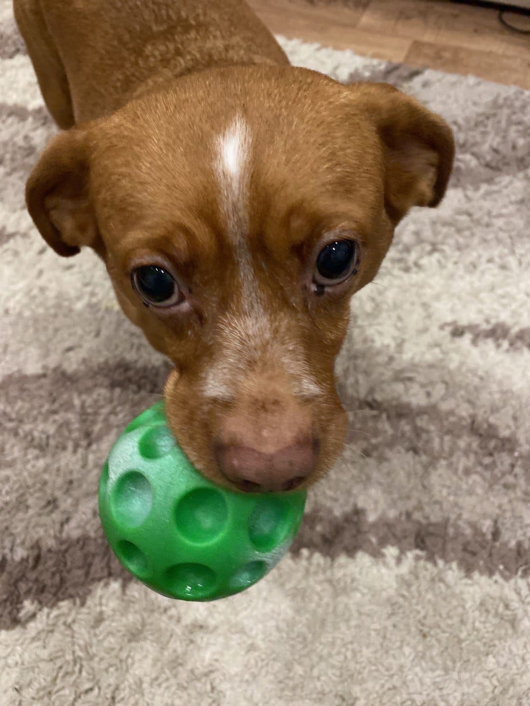

# О себе
{ width=300 }

Привет! Меня зовут **Арина Куприянова**.
## Образование

- **Бакалавриат** — Техническая Физика, ИТМО
- **Магистратура** — Управление высокотехнологичным бизнесом, ИТМО

## Работа

Сейчас я работаю **продуктовым аналитиком в Т банке**.

## Чем увлекаюсь

Я увлекаюсь **аналитикой данных** — мне нравится находить закономерности в цифрах и помогать бизнесу принимать решения на основе данных.

## Навыки

| Hard Skills | Soft Skills |
|-------------|-------------|
| Python (numpy, matplotlib, pandas) | Критическое мышление |
| SQL | Организация мероприятий |
| Статистика и AB-тесты | Публичные выступления |
| Визуализация данных | Работа в команде |
| Excel | |

## Хобби

-  Играю в покер
-  Езжу в приют для собак помогать
- ️ Люблю путешествовать
-  Организовываю мероприятия
-  Гуляю с друзьями